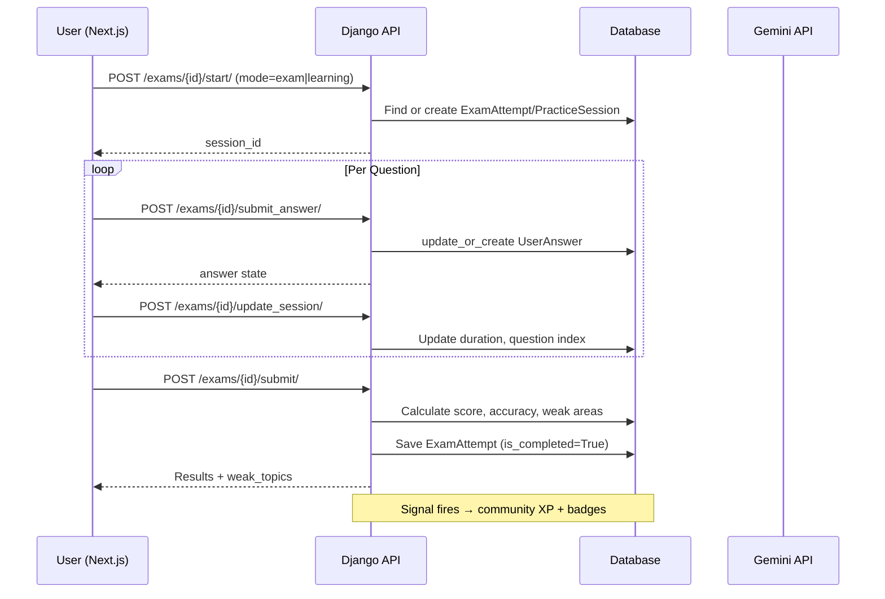
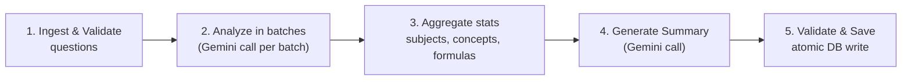
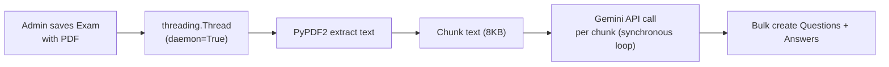
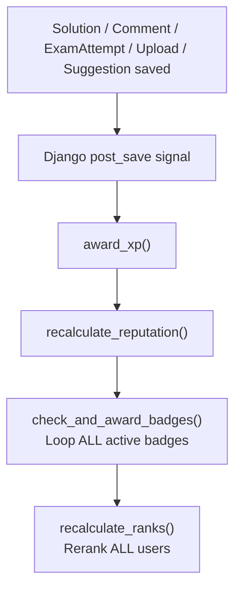

# 🏗️ AI Exam Engine — Full Architecture Analysis

> **Project:** Aspirant AI (ai_exam_engine)
> **Stack:** Django 4.2 · DRF 3.14 · PostgreSQL (SQLite dev) · Next.js (App Router) · Docker Compose · Gemini AI
> **Scan scope:** `backend/` + `frontend/`
> **Generated:** 2026-05-26

---

## 1. Architecture Diagram

```mermaid
graph TB
    subgraph "Frontend — Next.js (Vercel)"
        FE_PAGES["App Router Pages<br/>24 routes"]
        FE_COMPONENTS["Components<br/>31 UI components"]
        FE_API["API Layer<br/>api.ts + apiClient.ts"]
        FE_CTX["Context<br/>AuthContext · ExamLanguageContext"]
        FE_PAGES --> FE_COMPONENTS
        FE_COMPONENTS --> FE_API
        FE_PAGES --> FE_CTX
    end

    subgraph "Backend — Django/DRF (Render / Docker)"
        subgraph "quiz app"
            Q_API["quiz/api.py<br/>1103 lines · 8 ViewSets"]
            Q_MODELS["quiz/models.py<br/>679 lines · 17 models"]
            Q_SERIALIZERS["quiz/serializers.py"]
            Q_SERVICES["quiz/services.py<br/>Background thread launcher"]
            Q_AUTH["quiz/views_auth.py<br/>Register · Login · Password Reset"]
            Q_ADMIN["quiz/admin.py<br/>791 lines · Rich admin panel"]
        end

        subgraph "AI Engine (quiz/ai/)"
            AI_INIT["__init__.py<br/>PDF parse · Q-gen · Explain · Translate"]
            AI_GEMINI["gemini_client.py<br/>Retry + Fallback wrapper"]
            AI_SUMMARY["summary_service.py<br/>5-stage summary pipeline"]
            AI_ROADMAP["roadmap_engine.py<br/>PDF → Knowledge Graph"]
            AI_ANALYZER["question_analyzer.py<br/>Batch question intelligence"]
            AI_AGGREGATION["aggregation_engine.py<br/>Stats aggregator"]
            AI_PROMPT["prompt_builder.py"]
            AI_PATTERN["pattern_engine.py"]
            AI_CONCEPT["concept_engine.py"]
            AI_FORMULA["formula_engine.py"]
            AI_MARKDOWN["markdown_formatter.py"]
            AI_VALIDATORS["validators.py"]
        end

        subgraph "community app"
            C_VIEWS["community/views.py<br/>438 lines · 8 API views"]
            C_MODELS["community/models.py<br/>Profile · Badge · Solution · Comment · Notification"]
            C_SERVICES["community/services.py<br/>XP · Streak · Reputation · Ranking · Badges"]
            C_SIGNALS["community/signals.py<br/>7 signal handlers"]
        end

        subgraph "Management Commands"
            CMD_SUMMARY["generate_exam_summary"]
            CMD_ROADMAP["generate_roadmap"]
            CMD_AFFAIRS["fetch_current_affairs"]
        end

        Q_API --> Q_MODELS
        Q_API --> AI_INIT
        Q_ADMIN --> AI_INIT
        Q_ADMIN --> Q_SERVICES
        C_SIGNALS --> C_SERVICES
        AI_SUMMARY --> AI_GEMINI
        AI_ROADMAP --> AI_GEMINI
        AI_ANALYZER --> AI_GEMINI
        CMD_SUMMARY --> AI_SUMMARY
        CMD_ROADMAP --> AI_ROADMAP
        CMD_AFFAIRS --> AI_GEMINI
    end

    subgraph "Infrastructure"
        PG["PostgreSQL 15"]
        REDIS["Redis 7 (configured but unused)"]
        SQLITE["SQLite (dev fallback)"]
    end

    FE_API -->|"REST API<br/>Token Auth"| Q_API
    FE_API -->|"REST API"| C_VIEWS
    Q_MODELS --> PG
    Q_MODELS --> SQLITE
    AI_GEMINI -->|"HTTP"| GEMINI["Google Gemini API"]

    style REDIS stroke:#f59e0b,stroke-width:2px,stroke-dasharray: 5
```



---

## 2. Existing Flows

### 2.1 Core Exam Flow



### 2.2 AI Summary Pipeline (5-Stage)



### 2.3 Admin PDF Parsing Flow



### 2.4 Community Gamification Flow



> [!CAUTION]
> **Every single user action (comment, solution, exam completion) triggers a full re-ranking of ALL users.** This is O(N) per event and will become a serious bottleneck.

---

## 3. Bottlenecks

### 🔴 Critical

| # | Bottleneck | Location | Impact |
|---|-----------|----------|--------|
| B1 | **Synchronous AI calls block request threads** | [api.py:718-738](file:///Users/divyanshu/Desktop/ai_exam_engine/backend/quiz/api.py#L718-L738) (`explain_question`), [api.py:1068-1103](file:///Users/divyanshu/Desktop/ai_exam_engine/backend/quiz/api.py#L1068-L1103) (`ai_summary` on resources) | Gemini calls take 2-30s. Blocks gunicorn worker thread. Under load, all workers become saturated. |
| B2 | **`threading.Thread` for background work** | [api.py:258](file:///Users/divyanshu/Desktop/ai_exam_engine/backend/quiz/api.py#L258) (summary), [admin.py:349](file:///Users/divyanshu/Desktop/ai_exam_engine/backend/quiz/admin.py#L349) (PDF parse) | Threads are unmonitored, unrecoverable on crash, not distributed across workers, leak if gunicorn restarts. |
| B3 | **`recalculate_ranks()` on EVERY XP event** | [services.py:73-89](file:///Users/divyanshu/Desktop/ai_exam_engine/backend/community/services.py#L73-L89) | Fetches ALL profiles, iterates in Python, does N individual `UPDATE` queries. O(N²) per user action at scale. |
| B4 | **Leaderboard — unbounded query, in-memory sort** | [api.py:746-813](file:///Users/divyanshu/Desktop/ai_exam_engine/backend/quiz/api.py#L746-L813) | Global leaderboard: annotates ALL users, then builds Python list, sorts in memory. No pagination. |
| B5 | **PDF parse via Gemini: synchronous chunk loop** | [__init__.py:222-276](file:///Users/divyanshu/Desktop/ai_exam_engine/backend/quiz/ai/__init__.py#L222-L276) | Each chunk is a synchronous Gemini call with sleep(). A 20-page PDF = 10+ min blocking. |

### 🟡 Moderate

| # | Bottleneck | Location | Impact |
|---|-----------|----------|--------|
| B6 | **N+1 queries on dashboard_stats** | [api.py:689-714](file:///Users/divyanshu/Desktop/ai_exam_engine/backend/quiz/api.py#L689-L714) | `r.exam.title`, `r.exam.subcategory.category.name` inside list comprehension without `select_related`. |
| B7 | **N+1 in MyStatsView** | [views.py:180-254](file:///Users/divyanshu/Desktop/ai_exam_engine/backend/community/views.py#L180-L254) | 365-day heatmap + weekly chart + badges — 4+ queries that could be batched. |
| B8 | **No pagination on several list endpoints** | Leaderboard, CurrentAffairs list, dashboard history | All results returned in a single response. |
| B9 | **TopicResource search hits 4 fields with `icontains`** | [api.py:1020-1026](file:///Users/divyanshu/Desktop/ai_exam_engine/backend/quiz/api.py#L1020-L1026) | Full-text scan on `markdown_content` — extremely slow on large datasets. Needs `SearchVector`. |
| B10 | **Upvote race condition** | [views.py:100-110](file:///Users/divyanshu/Desktop/ai_exam_engine/backend/community/views.py#L100-L110) | `solution.upvotes += 1; solution.save()` — not atomic. Use `F('upvotes') + 1`. |

### 🟢 Low

| # | Bottleneck | Location | Impact |
|---|-----------|----------|--------|
| B11 | **`view_count` increment on every resource retrieve** | [api.py:1036-1043](file:///Users/divyanshu/Desktop/ai_exam_engine/backend/quiz/api.py#L1036-L1043) | Extra write per read. Consider buffering in Redis. |
| B12 | **Cache TTL too short (5 min)** | [api.py:92](file:///Users/divyanshu/Desktop/ai_exam_engine/backend/quiz/api.py#L92) | Exam data changes rarely; 5 min cache provides minimal benefit under load. |
| B13 | **SQLite in development** | [settings.py:90-96](file:///Users/divyanshu/Desktop/ai_exam_engine/backend/core/settings.py#L90-L96) | Feature/performance parity gap with production PostgreSQL. |

---

## 4. Migration Risks

### 🔴 High Risk

| Risk | Detail | Files Affected |
|------|--------|----------------|
| **Thread → Celery migration** | 3 places use `threading.Thread`. Migrating to Celery requires adding `celery.py`, a broker (Redis is already in docker-compose), and converting thread targets to `@shared_task`. The summary endpoint's 202 polling pattern must be preserved. | [api.py:236-265](file:///Users/divyanshu/Desktop/ai_exam_engine/backend/quiz/api.py#L236-L265), [admin.py:339-357](file:///Users/divyanshu/Desktop/ai_exam_engine/backend/quiz/admin.py#L339-L357), [services.py:5-32](file:///Users/divyanshu/Desktop/ai_exam_engine/backend/quiz/services.py#L5-L32) |
| **`recalculate_ranks()` refactor** | Currently synchronous in the signal chain. Moving to async/periodic task will cause temporary rank staleness. Frontend community/contributors pages show ranks and percentiles. | [services.py:73-89](file:///Users/divyanshu/Desktop/ai_exam_engine/backend/community/services.py#L73-L89), [signals.py](file:///Users/divyanshu/Desktop/ai_exam_engine/backend/community/signals.py), all contributor frontend pages |
| **SQLite → PostgreSQL** | `db.sqlite3` is 1.5 MB in the repo. Migration requires data export/import. `JSONField` behavior differs between backends. | [settings.py:81-96](file:///Users/divyanshu/Desktop/ai_exam_engine/backend/core/settings.py#L81-L96), [models.py](file:///Users/divyanshu/Desktop/ai_exam_engine/backend/quiz/models.py) |

### 🟡 Medium Risk

| Risk | Detail | Files Affected |
|------|--------|----------------|
| **Redis cache backend not wired** | `REDIS_URL` is defined in settings and docker-compose, but Django's `CACHES` setting is never configured — so `cache.get/set` calls use `LocMemCache` (default). In production with multiple workers, cache is per-process and useless. | [settings.py:161](file:///Users/divyanshu/Desktop/ai_exam_engine/backend/core/settings.py#L161) |
| **Google `generativeai` SDK version** | Pinned to `0.3.1` — current is 0.8.x. API surface has changed significantly. `genai.GenerativeModel` constructor and `generate_content` return types may differ. | [requirements.txt:4](file:///Users/divyanshu/Desktop/ai_exam_engine/backend/requirements.txt#L4) |
| **Dual API clients** | Frontend has both `api.ts` (axios) and `apiClient.ts` (native fetch). Two auth injection paths, two error handlers. Risk of bugs when one is updated but not the other. | [api.ts](file:///Users/divyanshu/Desktop/ai_exam_engine/frontend/src/lib/api.ts), [apiClient.ts](file:///Users/divyanshu/Desktop/ai_exam_engine/frontend/src/lib/apiClient.ts) |
| **`AllowAny` as global default** | `DEFAULT_PERMISSION_CLASSES = ['AllowAny']` means any new viewset without explicit permissions is public by default. | [settings.py:192](file:///Users/divyanshu/Desktop/ai_exam_engine/backend/core/settings.py#L192) |

### 🟢 Low Risk

| Risk | Detail |
|------|--------|
| **Email backend is console-only** | Password reset emails print to stdout. Production needs SMTP/SES config. |
| **Hardcoded localhost in password reset link** | [views_auth.py:68](file:///Users/divyanshu/Desktop/ai_exam_engine/backend/quiz/views_auth.py#L68) |
| **`resources` app in core URLs but not in scan** | `path('api/resource-hub/', include('resources.urls'))` — a `resources/` app exists but may be orphaned or in-progress. |

---

## 5. Async Candidates

These are operations currently running synchronously that should be converted to async (Celery tasks or at minimum Django-Q):

| Priority | Operation | Current Approach | Recommended | Latency Impact |
|----------|-----------|-----------------|-------------|----------------|
| 🔴 P0 | **PDF → Questions parsing** | `threading.Thread` in admin.save_model | `@shared_task` + Celery | 2-10 min → immediate 202 |
| 🔴 P0 | **Exam AI Summary generation** | `threading.Thread` in API view | `@shared_task` + Celery | 30-120s → immediate 202 |
| 🔴 P0 | **AI Explanation generation** | Synchronous in request cycle | `@shared_task` + WebSocket/polling | 2-10s → immediate 202 |
| 🟡 P1 | **Hindi translation (single question)** | Synchronous in admin action | `@shared_task` (batch) | 3-8s per question |
| 🟡 P1 | **Hindi translation (bulk admin action)** | Synchronous loop in request | `@shared_task` group | N × 3-8s = minutes |
| 🟡 P1 | **Resource AI summary (admin action)** | Synchronous Gemini call per resource | `@shared_task` | 2-5s per resource |
| 🟡 P1 | **`recalculate_ranks()`** | Synchronous in signal chain | Periodic Celery beat (every 5 min) | Removes O(N) from every user action |
| 🟡 P1 | **`check_and_award_badges()`** | Synchronous loop over ALL badges | `@shared_task` debounced | Loops all badges on every XP event |
| 🟢 P2 | **`fetch_current_affairs` command** | Management command (manual) | Celery beat periodic task | Could run daily automatically |
| 🟢 P2 | **`generate_roadmap` command** | Management command (manual) | `@shared_task` triggered from admin | Manual → on-demand |
| 🟢 P2 | **View count buffering** | Atomic DB write per read | Redis INCR + periodic flush | 1 write/read → 1 write/100 reads |
| 🟢 P2 | **Email (password reset)** | `send_mail()` in request cycle | `@shared_task` | SMTP latency removed from response |

---

## 6. Caching Opportunities

| What | Current State | Recommendation | Cache Key Pattern | TTL |
|------|--------------|----------------|-------------------|-----|
| Exam detail | ✅ 5 min LocMemCache | Redis, bump to 30 min | `exam:{id}:{lang}` | 30 min |
| Exam questions | ✅ 5 min LocMemCache | Redis, bump to 30 min | `exam_questions:{id}:{lang}:{mode}` | 30 min |
| Category list | ❌ None | Redis | `categories:active` | 1 hour |
| SubCategory list | ❌ None | Redis | `subcategories:{cat_slug}` | 1 hour |
| Dashboard stats | ❌ None (per-request queries) | Redis, per-user | `dashboard:{user_id}` | 5 min |
| Leaderboard (global) | ❌ None | Redis | `leaderboard:global` | 5 min |
| Leaderboard (per-exam) | ❌ None | Redis | `leaderboard:exam:{id}` | 5 min |
| Category leaderboard | ✅ 5 min cache | Already cached, good | `cat_leaderboard_{days}` | 5 min ✓ |
| Community overview | ❌ None | Redis | `community:overview` | 10 min |
| Top contributors | ❌ None | Redis | `community:top:{page}` | 5 min |
| Resource search | ❌ None | Postgres `SearchVector` index | N/A (DB-level) | N/A |

> [!IMPORTANT]
> **The Django cache backend is NOT configured to use Redis.** All `cache.get/set` calls currently use `LocMemCache`, which is per-process and provides zero benefit with gunicorn's multiple workers. Add this to `settings.py`:
> ```python
> CACHES = {
>     'default': {
>         'BACKEND': 'django.core.cache.backends.redis.RedisCache',
>         'LOCATION': REDIS_URL,
>     }
> }
> ```

---

## 7. File Impact Map

A complete map of every significant file, its role, issues found, and what changes it would need:

### Backend — `quiz/` App

| File | Lines | Role | Issues Found | Change Priority |
|------|-------|------|-------------|-----------------|
| [api.py](file:///Users/divyanshu/Desktop/ai_exam_engine/backend/quiz/api.py) | 1103 | Main API views (8 ViewSets + 4 FBVs) | Sync AI calls (B1), threading (B2), unpaginated leaderboard (B4), N+1 in dashboard (B6) | 🔴 Critical |
| [models.py](file:///Users/divyanshu/Desktop/ai_exam_engine/backend/quiz/models.py) | 679 | 17 models + cache signals | Clean. Signal-based cache invalidation is correct. `question_text` defined twice on `Question` (L129 & L152) | 🟢 Low |
| [serializers.py](file:///Users/divyanshu/Desktop/ai_exam_engine/backend/quiz/serializers.py) | ~450 | DRF serializers | Not scanned in detail | 🟢 Low |
| [services.py](file:///Users/divyanshu/Desktop/ai_exam_engine/backend/quiz/services.py) | 33 | Background thread launcher for PDF parse | Should become Celery task | 🟡 Medium |
| [admin.py](file:///Users/divyanshu/Desktop/ai_exam_engine/backend/quiz/admin.py) | 791 | Rich Jazzmin admin panel | Sync AI admin actions (translation, summary), threading in save_model | 🟡 Medium |
| [views_auth.py](file:///Users/divyanshu/Desktop/ai_exam_engine/backend/quiz/views_auth.py) | 103 | Auth endpoints | Hardcoded localhost in reset link, sync email send | 🟡 Medium |
| [urls.py](file:///Users/divyanshu/Desktop/ai_exam_engine/backend/quiz/urls.py) | 36 | Route registration | Clean | 🟢 Low |

### Backend — `quiz/ai/` Engine

| File | Lines | Role | Issues Found | Change Priority |
|------|-------|------|-------------|-----------------|
| [__init__.py](file:///Users/divyanshu/Desktop/ai_exam_engine/backend/quiz/ai/__init__.py) | 418 | PDF parse, Q-gen, explain, translate | All sync. Multiple Gemini calls per function. Main async candidates. | 🔴 Critical |
| [gemini_client.py](file:///Users/divyanshu/Desktop/ai_exam_engine/backend/quiz/ai/gemini_client.py) | 104 | Retry + fallback Gemini wrapper | Good resilience pattern. `time.sleep()` blocks thread. Consider async client. | 🟡 Medium |
| [summary_service.py](file:///Users/divyanshu/Desktop/ai_exam_engine/backend/quiz/ai/summary_service.py) | 146 | 5-stage summary pipeline | Solid architecture. Already called from thread. Convert to Celery task. | 🟡 Medium |
| [roadmap_engine.py](file:///Users/divyanshu/Desktop/ai_exam_engine/backend/quiz/ai/roadmap_engine.py) | 139 | PDF → AI syllabus roadmap | Synchronous Gemini call. Called only from management command (acceptable). | 🟢 Low |
| [question_analyzer.py](file:///Users/divyanshu/Desktop/ai_exam_engine/backend/quiz/ai/question_analyzer.py) | 108 | Batch question intelligence | Synchronous Gemini calls. Part of summary pipeline. | 🟡 Medium |
| [aggregation_engine.py](file:///Users/divyanshu/Desktop/ai_exam_engine/backend/quiz/ai/aggregation_engine.py) | 174 | Stats aggregator (no AI calls) | Pure Python. No issues. | 🟢 Low |
| [prompt_builder.py](file:///Users/divyanshu/Desktop/ai_exam_engine/backend/quiz/ai/prompt_builder.py) | ~160 | Prompt templates | Pure Python. No issues. | 🟢 Low |
| [pattern_engine.py](file:///Users/divyanshu/Desktop/ai_exam_engine/backend/quiz/ai/pattern_engine.py) | ~60 | Pattern extraction | Pure Python. No issues. | 🟢 Low |
| [concept_engine.py](file:///Users/divyanshu/Desktop/ai_exam_engine/backend/quiz/ai/concept_engine.py) | ~25 | Concept normalization | Pure Python. No issues. | 🟢 Low |
| [formula_engine.py](file:///Users/divyanshu/Desktop/ai_exam_engine/backend/quiz/ai/formula_engine.py) | ~25 | Formula formatting | Pure Python. No issues. | 🟢 Low |

### Backend — `community/` App

| File | Lines | Role | Issues Found | Change Priority |
|------|-------|------|-------------|-----------------|
| [views.py](file:///Users/divyanshu/Desktop/ai_exam_engine/backend/community/views.py) | 438 | 8 API views (profile, stats, leaderboard, badges) | N+1 in MyStatsView (B7), heatmap 365-day query | 🟡 Medium |
| [models.py](file:///Users/divyanshu/Desktop/ai_exam_engine/backend/community/models.py) | 156 | Profile, Badge, Solution, Comment, Notification | Clean. Good use of denormalized counters. | 🟢 Low |
| [services.py](file:///Users/divyanshu/Desktop/ai_exam_engine/backend/community/services.py) | 191 | XP, streak, reputation, ranking, badge logic | `recalculate_ranks()` O(N) on every event (B3), upvote race (B10) | 🔴 Critical |
| [signals.py](file:///Users/divyanshu/Desktop/ai_exam_engine/backend/community/signals.py) | 183 | 7 post_save signal handlers | Trigger full rank recalculation chain. Should debounce or go async. | 🟡 Medium |

### Backend — `core/`

| File | Lines | Role | Issues Found | Change Priority |
|------|-------|------|-------------|-----------------|
| [settings.py](file:///Users/divyanshu/Desktop/ai_exam_engine/backend/core/settings.py) | 363 | Django settings | Redis URL defined but CACHES not configured. AllowAny default. GEMINI_API_KEY crash on missing. | 🔴 Critical (cache config) |
| [urls.py](file:///Users/divyanshu/Desktop/ai_exam_engine/backend/core/urls.py) | 20 | Root URL config | References `resources.urls` (app not scanned) | 🟢 Low |

### Backend — Management Commands

| File | Role | Issues | Priority |
|------|------|--------|----------|
| [generate_exam_summary.py](file:///Users/divyanshu/Desktop/ai_exam_engine/backend/quiz/management/commands/generate_exam_summary.py) | Batch summary generation | Synchronous, long-running. Good for CLI but should also be triggerable as Celery task. | 🟢 Low |
| [generate_roadmap.py](file:///Users/divyanshu/Desktop/ai_exam_engine/backend/quiz/management/commands/generate_roadmap.py) | Roadmap from PDF syllabus | Clean. Atomic DB write. | 🟢 Low |
| [fetch_current_affairs.py](file:///Users/divyanshu/Desktop/ai_exam_engine/backend/quiz/management/commands/fetch_current_affairs.py) | RSS → Gemini → CurrentAffair | Should be Celery beat. `newspaper3k` `article.download()` can hang (15s timeout set). | 🟡 Medium |

### Frontend — Key Files

| File | Size | Role | Issues | Priority |
|------|------|------|--------|----------|
| [exam-taking-interface.tsx](file:///Users/divyanshu/Desktop/ai_exam_engine/frontend/src/components/exam-taking-interface.tsx) | 76 KB | Main exam UI | Massive single-file component. Should be split. | 🟡 Refactor |
| [api.ts](file:///Users/divyanshu/Desktop/ai_exam_engine/frontend/src/lib/api.ts) | 239 lines | Axios API layer | Clean. Handles auth tokens. | 🟢 Low |
| [apiClient.ts](file:///Users/divyanshu/Desktop/ai_exam_engine/frontend/src/lib/apiClient.ts) | 152 lines | Native fetch API layer | **Duplicate** of api.ts with different error handling. Consolidate. | 🟡 Medium |
| [navbar.tsx](file:///Users/divyanshu/Desktop/ai_exam_engine/frontend/src/components/navbar.tsx) | 21 KB | Navigation bar | Large component | 🟢 Low |
| [topic-resource-hub.tsx](file:///Users/divyanshu/Desktop/ai_exam_engine/frontend/src/components/topic-resource-hub.tsx) | 23 KB | Resource browser | Large component | 🟢 Low |
| [suggest-correction-modal.tsx](file:///Users/divyanshu/Desktop/ai_exam_engine/frontend/src/components/suggest-correction-modal.tsx) | 22 KB | Correction form | Large for a modal | 🟢 Low |

### Infrastructure

| File | Role | Issues |
|------|------|--------|
| [docker-compose.yml](file:///Users/divyanshu/Desktop/ai_exam_engine/docker-compose.yml) | Dev orchestration | PostgreSQL + Redis + Backend + Frontend. **Redis is running but not consumed by Django.** |
| [Dockerfile (backend)](file:///Users/divyanshu/Desktop/ai_exam_engine/backend/Dockerfile) | Backend container | Uses `runserver` (not gunicorn) — fine for dev only. |
| [requirements.txt](file:///Users/divyanshu/Desktop/ai_exam_engine/backend/requirements.txt) | Python deps | `google-generativeai==0.3.1` severely outdated. `openai` listed but unused. |

---

## 8. Summary of All AI Call Sites

Every location where a Gemini API call is made:

| # | Function | File | Trigger | Sync? | Avg Latency |
|---|----------|------|---------|-------|-------------|
| 1 | `generate_questions_from_pdf()` | [ai/__init__.py:98](file:///Users/divyanshu/Desktop/ai_exam_engine/backend/quiz/ai/__init__.py#L98) | Admin save + admin action | ⚠️ Thread | 2-10 min |
| 2 | `generate_explanation_for_question()` | [ai/__init__.py:177](file:///Users/divyanshu/Desktop/ai_exam_engine/backend/quiz/ai/__init__.py#L177) | API `explain_question` | 🔴 Sync | 2-5s |
| 3 | `parse_exam_paper_with_ai()` | [ai/__init__.py:204](file:///Users/divyanshu/Desktop/ai_exam_engine/backend/quiz/ai/__init__.py#L204) | API `parse_pdf` action | 🔴 Sync | 2-10 min |
| 4 | `translate_question_to_hindi()` | [ai/__init__.py:313](file:///Users/divyanshu/Desktop/ai_exam_engine/backend/quiz/ai/__init__.py#L313) | Admin action + button | 🔴 Sync | 3-8s |
| 5 | `ExamSummaryService.generate_summary()` | [ai/summary_service.py:20](file:///Users/divyanshu/Desktop/ai_exam_engine/backend/quiz/ai/summary_service.py#L20) | API summary + mgmt cmd | ⚠️ Thread | 30-120s |
| 6 | `RoadmapEngine.parse_syllabus()` | [ai/roadmap_engine.py:36](file:///Users/divyanshu/Desktop/ai_exam_engine/backend/quiz/ai/roadmap_engine.py#L36) | Management command | 🟢 CLI only | 10-30s |
| 7 | `fetch_current_affairs` | [commands/fetch_current_affairs.py:77](file:///Users/divyanshu/Desktop/ai_exam_engine/backend/quiz/management/commands/fetch_current_affairs.py#L77) | Management command | 🟢 CLI only | 2-5s/article |
| 8 | `TopicResourceViewSet.ai_summary()` | [api.py:1068-1103](file:///Users/divyanshu/Desktop/ai_exam_engine/backend/quiz/api.py#L1068-L1103) | Admin-only API endpoint | 🔴 Sync | 2-5s |
| 9 | `generate_ai_summary` admin action | [admin.py:99-129](file:///Users/divyanshu/Desktop/ai_exam_engine/backend/quiz/admin.py#L99-L129) | Admin bulk action | 🔴 Sync | N × 2-5s |

---

## 9. Prioritized Action Items

### Phase 1 — Infrastructure (Unblock everything else)
1. **Configure Redis as Django cache backend** (settings.py, 5 min)
2. **Add Celery + Redis broker** (new `celery.py`, `__init__.py`, update `requirements.txt`)
3. **Wire Celery into Docker Compose** (add worker service)

### Phase 2 — Async Migration (Remove thread bombs)
4. **Convert `threading.Thread` calls to Celery tasks** (api.py summary, admin.py PDF parse, services.py)
5. **Make `explain_question` async** (return 202 + polling or WebSocket)
6. **Move `recalculate_ranks()` to periodic Celery beat** (every 5 min instead of every event)

### Phase 3 — Query & Cache Optimization
7. **Add `select_related` to dashboard_stats and leaderboard queries**
8. **Paginate leaderboard, current affairs, and all unbounded list endpoints**
9. **Add Redis caching to dashboard, leaderboard, categories**
10. **Replace `icontains` search with PostgreSQL `SearchVector`**

### Phase 4 — Hardening
11. **Fix upvote race condition** (use `F()` expressions)
12. **Consolidate dual frontend API clients**
13. **Upgrade `google-generativeai` to current version**
14. **Remove unused `openai` dependency**
15. **Change `DEFAULT_PERMISSION_CLASSES` to `IsAuthenticated`**
